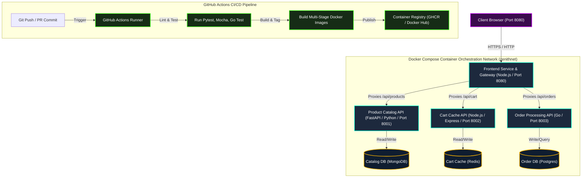

# ZenithCart: Cloud-Native E-Commerce Microservices Orchestration

Welcome to **ZenithCart**, an enterprise-grade, cloud-native e-commerce application designed to showcase modern microservices architecture, containerization, local orchestration, and automated CI/CD pipelines.

This repository implements a complete DevOps engineering project focusing on microservices deployment using **Docker Compose** and **GitHub Actions**.

---

## 1. Selected Title
**"ZenithCart: Cloud-Native E-Commerce Microservices Orchestration with Docker Compose & GitHub Actions"**

---

## 2. Problem Statement
Modern enterprise software has transitioned from monolithic models to decoupled microservices to achieve high agility, independent scaling, and fault tolerance. However, this transition introduces severe operational challenges:
* **"Works on My Machine" Syndrome**: Mismatches between developer local environments and production systems lead to frequent build failures and deployment delays.
* **Complex Multi-Service Orchestration**: Coordinating multiple languages (Node.js, Go, Python), separate datastores (MongoDB, Redis, PostgreSQL), and their networking parameters manually is slow, error-prone, and hard to manage.
* **Onboarding Friction**: New team members spend days or weeks installing databases, specific runtimes, and local dependencies before writing a single line of code.
* **Lack of Automated Verification (CI/CD)**: Manual build and test cycles lead to insecure container configurations, syntax errors, and untested code slipping into staging.

### The Solution
**ZenithCart** resolves these issues by containerizing every service using multi-stage, highly-optimized Dockerfiles, orchestrating the entire network of services and databases via a single, self-healing **Docker Compose** config, and ensuring every commit is verified through a robust **GitHub Actions** CI/CD pipeline.

---

## 3. DevOps Tools & Technologies
The deployment and development stack is composed of industry-standard tools:
* **Docker & Docker Engine**: For packaging services and dependencies into immutable, isolated container images.
* **Docker Compose**: For orchestrating the multi-container stack, local isolated bridge network, database initialization, volumes, and health checks with a single command.
* **GitHub Actions**: To automate continuous integration (CI) including lint checking, service unit testing, security scanning, container image building, and automated mock deployments.
* **FastAPI (Python 3.10) & Pytest**: High-performance backend engine for the Product Catalog API.
* **Express (Node.js 18) & Mocha/Chai**: High-speed, event-driven web servers for the Frontend Gateway and Cart Cache Service.
* **Go (Golang 1.20)**: Lightning-fast compiled language for Order Processing logic.
* **Datastores (MongoDB, Redis, PostgreSQL)**: Multi-model database layer showing polyglot persistence (Document database for catalog, Cache database for cart, and Relational database for transactional orders).

---

## 4. Architecture Diagram
The architecture leverages a reverse-proxy API Gateway built into the Frontend Node service. All external user traffic flows to port `8080`, and the Gateway dynamically proxies backend API requests (`/api/products`, `/api/cart`, `/api/orders`) to internal services across an isolated Docker network.



---

## 5. Deployment and Verification Instructions

### Prerequisites
* **Docker Desktop** installed and running.
* **Git** installed.

### Step-by-Step Local Deployment
1. **Clone the repository** and navigate to the project directory:
   ```bash
   cd microservices-ecommerce-deployment
   ```
2. **Build and spin up the complete application stack**:
   ```bash
   docker compose up --build -d
   ```
   *The `-d` flag runs containers in detached mode, and `--build` ensures fresh image compilation from the Dockerfiles.*

3. **Verify running containers and service health status**:
   ```bash
   docker compose ps
   ```
   *You should see all 7 containers (4 services + 3 databases) listed as `Up` and reporting `healthy`.*

4. **Access the application**:
   * Open `http://localhost:8080` in your web browser.
   * You will see the glowing glassmorphism e-commerce storefront with pre-seeded laptops, keyboards, and accessories.
   * Add items to the cart, refresh the page to verify Redis caching persists, and check out to process orders securely via PostgreSQL.

5. **Tear down the deployment**:
   ```bash
   docker compose down -v
   ```
   *The `-v` flag removes the volumes, ensuring a clean slate for subsequent runs.*
